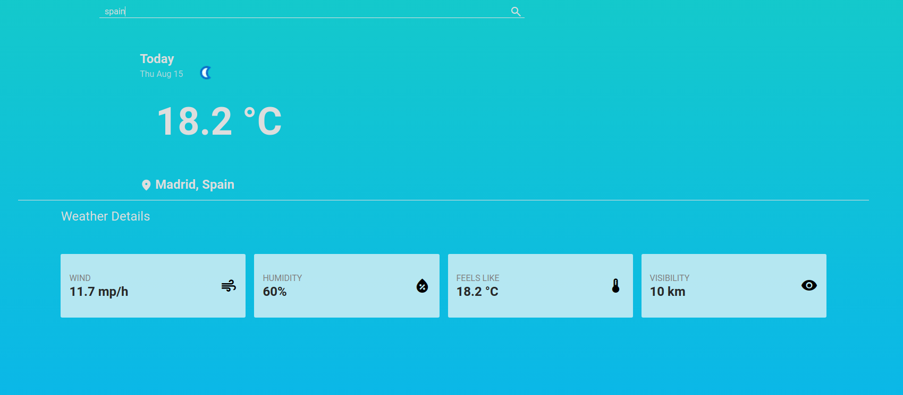

# Weather App
Live demo &#128073; https://masecurity.github.io/Weather-App/
## What is this project about?

<br>
Users can use this project to look for global weather conditions. Using HTML, CSS, JavaScript,Webpack and weatherAPI, this project was constructed.

## What i learned
- Asynchronous code (Promises, Callbacks)
- APIs
- Fetch
- Async and Await
- animation and keyframes


## Dependencies
Quick tip: Dependencies can be installed from the package.json file by running npm install.
```properties
npm install
```